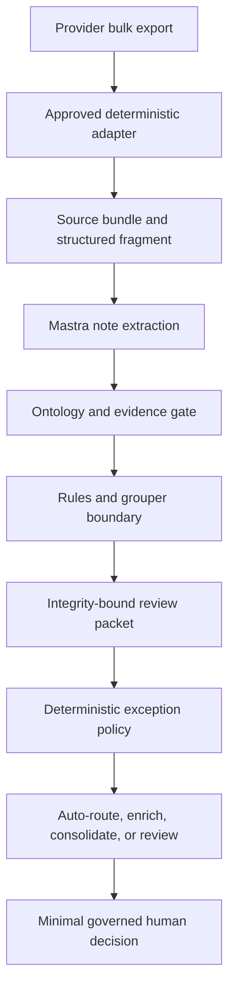

# Encounter Revenue Integrity

An evidence-grounded reference implementation that reconstructs a clinical encounter once and then reasons about it through **two governed lenses on one deterministic spine**: **revenue integrity** (comparing documentation with coding and billing and routing consequential exceptions to reviewers) and **clinical care gaps** (identifying gaps in guideline-expected care over a longitudinal episode and routing them to a clinician). [Mastra](https://mastra.ai/) provides provider-agnostic semantic extraction; both lenses run on the same deterministic, model-independent engine.

> **Not for production billing or clinical use.** The included rules, codes, prices and demo grouper are synthetic integration artifacts that have not been clinically or operationally validated.

> 📖 **New here?** Start with the [onboarding guide](docs/guide/README.md) — a ~30-minute tour covering purpose, how it works end-to-end (with the Diabetic Foot Ulcer worked example), the technical implementation, the clinical care-gap domain, a quickstart, and a glossary.

## Architecture

Clinical records benefit from semantic extraction. Claim grouping, rule evaluation, payment simulation and audit records must remain reproducible. The agent therefore produces **schema-constrained evidence and hypotheses, never executable rules or authoritative financial fields**. Variable provider exports are handled by an adapter factory: Mastra proposes a draft declarative mapping from a bounded profile, while an approved deterministic runtime processes the full dataset.

### One spine, two lenses

The engine runs a single spine — **episode → ontology → detect → validate → route → close** — carrying two peer rule domains keyed by a `rule_domain` field:

- **`revenue_integrity`** — proposes evidence-grounded *candidate* claim corrections for human review.
- **`clinical_care_gap`** — surfaces gaps in expected care as analytics alerts for a clinician. A clinical rule carries an **empty** `proposed_change` and **must** require human review, so the domain is structurally walled off from ever mutating a claim, assigning a DRG, computing reimbursement, or bypassing review. Detection uses deterministic (LLM-free) temporal and co-occurrence operators (`elapsed_days_gte`/`_lte`, `absent_within_days`, `pct_change_gte`/`_lte`, bounded `co_occurs`). Both lenses share the same authoritative wound-care ontology (v3, `1.3.0-draft`). See [docs/ARCHITECTURE.md](docs/ARCHITECTURE.md).



The case model separates what happened clinically, what was explicitly documented, what was coded and charged, what was submitted and paid, and what evidence supports or contradicts a proposed change.

## Current capabilities

- Canonical source-bundle and encounter-case JSON Schemas
- Bounded CSV, JSON, JSONL and XLSX bulk profiling with schema-drift and content-manifest fingerprints
- Versioned declarative adapters with row filters, composite keys, safe transforms and structured ontology projections
- Provider-agnostic Mastra adapter designer with bounded repair feedback and no code-generation path
- Deterministic row-level provenance linking structured facts to source files, records and fields
- Data-driven ontology definitions with inheritance and relation domain/range validation
- Cross-runtime semantic ontology digests that reject unversioned definition drift
- Patient-specific graphs linking assertions to typed subjects and exact evidence
- Mastra model routing through a configurable `provider/model` ID
- Claims, charges, DRGs and payment fields excluded from model generation
- Exact-excerpt grounding against immutable source documents
- Supporting and contradicting evidence lineage
- A second governed peer rule domain — clinical care gaps (`rules/wound_care_gaps_v1.json`, 46 rules incl. a diabetic-foot-ulcer flagship) — on the same spine, structurally walled off from claim mutation (empty `proposed_change`, human review required) and detected with deterministic temporal/co-occurrence operators over a longitudinal episode
- Strict, declarative JSON rules with no generated-code execution path
- Expressive deterministic rule operators (`between`, `starts_with`, `count_gte`/`count_lte`) and Python-derived read-only fields (`evidence_count`, `has_contradicting_evidence`) so rules reason about severity and contradiction off the ontology
- Data-driven, versioned deterministic DRG grouper (base rate + MCC/CC severity tiers) governed by a `demo_grouping_v1.json` artifact, with a hash-stable derivation trace surfaced on every finding and in the review packet (`3.2.0`) for reviewer explainability
- Present-on-admission (POA) and DRG severity tier modeled as first-class ontology concepts (classes, value-sets, relations), and a second governed rule package (`wound_care_v2.json`) that exercises them end-to-end
- Deterministic ontology-subgraph retrieval that sends the extraction agent only the relevant ontology slice, cutting prompt tokens without ever widening what the validators accept
- Ontology-scoped rule targeting with explicit subtype semantics
- Fail-closed package approval and action validation
- Replaceable licensed DRG grouper/pricer interface
- Integer-cent payment simulation
- Deterministic finding IDs and hash-chained audit records, with a read-only chain-continuity verifier
- Deterministic, hash-covered ROI/impact rollup and reviewer-effort estimate in the review handoff
- Offline precision/recall/F1 accuracy harness and backtest over a labeled gold set (`revenue-integrity-eval`)
- Golden-artifact conformance and executable core-invariant test suites that fail closed on governed-contract drift
- Versioned human-review packets connecting engine output to reviewer applications
- Deterministic exception orchestration with duplicate consolidation and effort budgets
- Idempotent automatic-routing outbox that cannot mutate claims
- One-click, policy-bound reviewer actions with structured feedback labels
- Atomic CLI output, CI, dependency monitoring and cross-language tests
- Configurable input/output resource budgets at both trust boundaries
- Governed source artifacts with checksum and authority enforcement

## Repository layout

```text
agent/          Provider-agnostic Mastra extraction service
demo/           Interactive React pitch and reviewer workflow
schemas/        Source and encounter interoperability contracts
knowledge/      Source manifests and non-executable governance records
rules/          Versioned declarative rule packages
examples/       Deidentified synthetic fixtures
src/            Deterministic models, rules, grouper boundary and audit code
tests/          Correctness, malformed-input and safety tests
docs/           Architecture and trust-boundary decisions
```

## Quick start

Python 3.11+ and Node.js 22+ are required.

```bash
python -m venv .venv
source .venv/bin/activate
python -m pip install -e .

cd agent
npm ci
cd ..

cd demo
npm ci
cd ..

make verify
make demo
```

## Run the interactive pitch demo

The `demo/` application turns the architecture into a three-minute product story: adaptive provider onboarding, evidence-linked encounter reconstruction, deterministic claim comparison, and focused human review.

```bash
cd demo
npm ci
npm run dev
```

Choose **Start guided demo** for the five-step narrative, or explore the command center, review queue, encounter graph, onboarding, and governance views directly. All cases, facilities, metrics, DRGs, and payment amounts shown in this interface are synthetic or illustrative. See [demo/README.md](demo/README.md) for the pitch script and demo boundaries.

The deterministic demo creates a review finding, supporting evidence, a proposed code change, demo regrouping and payment delta. It never modifies or submits a claim.

Generate the same versioned handoff consumed by the pitch application:

```bash
revenue-integrity examples/case_pressure_injury.json rules/wound_care_v1.json \
  --tenant-id tenant-demo-alpha --workspace-id workspace-revenue-integrity \
  --format review-packet --environment synthetic \
  --output output/review-packet.json
```

The v0.7 release uses encounter-case schema `2.0.0`, tenant-scoped review-packet schema `3.1.0`, automation-plan schema `1.0.0`, and review-decision schema `2.0.0`. Earlier payloads intentionally fail closed until they satisfy these trust boundaries. Revenue rule packages and bulk adapters must declare their compatible ontology ID, version and digest.

Review-packet `3.1.0` adds a deterministic, hash-covered `impact_summary` ROI rollup; the automation plan adds an itemized `priority_components` score (uncapped dollar weighting) and a `reviewer_effort` estimate. See [docs/REVIEW_PACKET.md](docs/REVIEW_PACKET.md) and [docs/AUTOMATION.md](docs/AUTOMATION.md).

Reviewer actions pass through a role-aware workflow service and a tenant-scoped, hash-linked SQLite reference repository. A separately hashed automation plan suppresses only exact duplicates/no-opportunities, requests enrichment for insufficient evidence, automatically queues bounded operational work, and reserves people for quick confirmations or true exceptions. See [exception automation](docs/AUTOMATION.md), [the governed review workflow](docs/REVIEW_WORKFLOW.md), and [production integration boundaries](docs/PRODUCTION_INTEGRATIONS.md).

## Run the bulk-ingestion demo

```bash
revenue-integrity-ingest profile examples/bulk/clinic_alpha \
  --output output/clinic-alpha.profile.json

revenue-integrity-ingest run \
  examples/bulk/clinic_alpha \
  examples/adapters/clinic_alpha_wound_care_v1.json \
  --output-directory output/source-bundles \
  --report output/clinic-alpha.run.json
```

The full provider folder is processed by deterministic readers and transforms. Only the bounded profile is suitable for the adapter-designer agent; narrative document text is sent separately to the evidence-extraction agent. Claims, charges, existing DRGs and payment fields remain outside model generation.

## Measure discovery accuracy

```bash
make eval    # scores the shipped gold set and enforces its thresholds
# or:
revenue-integrity-eval examples/evaluation/gold_manifest.json --output output/eval-report.json
```

The harness runs the deterministic engine over a labeled gold manifest and emits a canonical,
hash-signed precision/recall/F1 report. It is the honest source for any accuracy figure and never
touches a claim, DRG, or payment. See [docs/EVALUATION.md](docs/EVALUATION.md).

## Run the Mastra extraction layer

```bash
cd agent
cp .env.example .env

# Select any Mastra-supported provider/model and set that provider's API key.
MODEL_ID=anthropic/<model> npm run extract -- \
  ../examples/source_bundle_pressure_injury.json \
  ../output/encounter-case.json \
  ../src/revenue_integrity/data/wound_care_ontology_v1.json
```

The application does not import a provider SDK. Changing `MODEL_ID` changes the extraction model without changing the ontology or deterministic engine.

## Trust boundary

The agent receives encounter timing, an ontology contract and source documents, but not the claim, charges, existing DRG or payment. It returns evidence excerpts, a patient-specific ontology fragment and materialized clinical assertions. The orchestrator then:

1. validates the source bundle;
2. verifies every excerpt is an exact source substring;
3. verifies the document ID, author role and timestamp are unchanged;
4. validates entity types, relation domain/range, evidence requirements, lineage and contradictions;
5. attaches structural patient, encounter and claim nodes outside the model;
6. attaches model and schema provenance outside the model;
7. merges immutable encounter and claim fields;
8. passes the completed case through an independent Python validator.

Invalid confidence values, unknown fields, duplicate IDs, naive timestamps, dangling citations, overlapping supporting/contradicting evidence and schema-version mismatches all fail closed. Any proposed claim change requires human review in this version.

## Extension path

New specialties are added as versioned ontology definitions and compatible rule packages rather than engine branches. Custom definitions can be injected into the same Python and TypeScript validators. Additional Mastra agents can handle retrieval, terminology normalization, conflict detection, coding/CDI hypothesis generation, charge reconciliation, compliance criticism and reviewer-packet drafting. Each agent must use an explicit contract. Agent consensus is not authoritative evidence.

Before real use, the project still requires licensed terminology and grouping components, FHIR/HL7 and claim adapters, institution-approved rules, representative positive and negative validation data, model/retrieval evaluations, a reviewer application and the security controls in [SECURITY.md](SECURITY.md).

See [docs/ADAPTER_FACTORY.md](docs/ADAPTER_FACTORY.md) for bulk onboarding, [docs/ONTOLOGY.md](docs/ONTOLOGY.md) for the domain-extension contract, [docs/REVIEW_PACKET.md](docs/REVIEW_PACKET.md) for the reviewer-application handoff, [docs/ARCHITECTURE.md](docs/ARCHITECTURE.md) for trust-boundary decisions and [CONTRIBUTING.md](CONTRIBUTING.md) for change requirements.

The supplied raw wound-care workbook is preserved at [knowledge/sources/wound_care_clinical_rules_raw.xlsx](knowledge/sources/wound_care_clinical_rules_raw.xlsx), governed by [knowledge/wound_care_source_manifest.json](knowledge/wound_care_source_manifest.json), and intentionally non-executable. See [docs/ITERATIVE_REVIEW.md](docs/ITERATIVE_REVIEW.md) for the completed five-pass design review and remaining production roadmap.

## License

Apache-2.0. Clinical rules, licensed terminologies, customer data and payer contracts must be distributed separately under their applicable terms.
