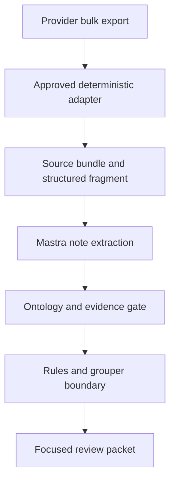

# Encounter Revenue Integrity

An evidence-grounded reference implementation for reconstructing an inpatient encounter, comparing documentation with coding and billing, and routing only consequential exceptions to human reviewers. [Mastra](https://mastra.ai/) provides provider-agnostic semantic extraction; the revenue-integrity engine remains deterministic and model-independent.

> **Not for production billing or clinical use.** The included rules, codes, prices and demo grouper are synthetic integration artifacts that have not been clinically or operationally validated.

## Architecture

Clinical records benefit from semantic extraction. Claim grouping, rule evaluation, payment simulation and audit records must remain reproducible. The agent therefore produces **schema-constrained evidence and hypotheses, never executable rules or authoritative financial fields**. Variable provider exports are handled by an adapter factory: Mastra proposes a draft declarative mapping from a bounded profile, while an approved deterministic runtime processes the full dataset.



The case model separates what happened clinically, what was explicitly documented, what was coded and charged, what was submitted and paid, and what evidence supports or contradicts a proposed change.

## Current capabilities

- Canonical source-bundle and encounter-case JSON Schemas
- Bounded CSV, JSON, JSONL and XLSX bulk profiling with schema-drift and content-manifest fingerprints
- Versioned declarative adapters with row filters, composite keys, safe transforms and structured ontology projections
- Provider-agnostic Mastra adapter designer with bounded repair feedback and no code-generation path
- Deterministic row-level provenance linking structured facts to source files, records and fields
- Data-driven ontology definitions with inheritance and relation domain/range validation
- Cross-runtime semantic ontology digests that reject unversioned definition drift
- Patient-specific graphs linking assertions to typed subjects and exact evidence
- Mastra model routing through a configurable `provider/model` ID
- Claims, charges, DRGs and payment fields excluded from model generation
- Exact-excerpt grounding against immutable source documents
- Supporting and contradicting evidence lineage
- Strict, declarative JSON rules with no generated-code execution path
- Ontology-scoped rule targeting with explicit subtype semantics
- Fail-closed package approval and action validation
- Replaceable licensed DRG grouper/pricer interface
- Integer-cent payment simulation
- Deterministic finding IDs and hash-chained audit records
- Atomic CLI output, CI, dependency monitoring and cross-language tests
- Configurable input/output resource budgets at both trust boundaries
- Governed source artifacts with checksum and authority enforcement

## Repository layout

```text
agent/          Provider-agnostic Mastra extraction service
schemas/        Source and encounter interoperability contracts
knowledge/      Source manifests and non-executable governance records
rules/          Versioned declarative rule packages
examples/       Deidentified synthetic fixtures
src/            Deterministic models, rules, grouper boundary and audit code
tests/          Correctness, malformed-input and safety tests
docs/           Architecture and trust-boundary decisions
```

## Quick start

Python 3.11+ and Node.js 22+ are required.

```bash
python -m venv .venv
source .venv/bin/activate
python -m pip install -e .

cd agent
npm ci
cd ..

make verify
make demo
```

The deterministic demo creates a review finding, supporting evidence, a proposed code change, demo regrouping and payment delta. It never modifies or submits a claim.

The v0.4 release uses encounter-case schema `2.0.0`. Earlier case payloads intentionally fail closed until they add a versioned, fingerprinted `ontology` graph and bind every assertion through `subject_id`. Revenue rule packages and bulk adapters must declare their compatible ontology ID, version and digest.

## Run the bulk-ingestion demo

```bash
revenue-integrity-ingest profile examples/bulk/clinic_alpha \
  --output output/clinic-alpha.profile.json

revenue-integrity-ingest run \
  examples/bulk/clinic_alpha \
  examples/adapters/clinic_alpha_wound_care_v1.json \
  --output-directory output/source-bundles \
  --report output/clinic-alpha.run.json
```

The full provider folder is processed by deterministic readers and transforms. Only the bounded profile is suitable for the adapter-designer agent; narrative document text is sent separately to the evidence-extraction agent. Claims, charges, existing DRGs and payment fields remain outside model generation.

## Run the Mastra extraction layer

```bash
cd agent
cp .env.example .env

# Select any Mastra-supported provider/model and set that provider's API key.
MODEL_ID=anthropic/<model> npm run extract -- \
  ../examples/source_bundle_pressure_injury.json \
  ../output/encounter-case.json \
  ../src/revenue_integrity/data/wound_care_ontology_v1.json
```

The application does not import a provider SDK. Changing `MODEL_ID` changes the extraction model without changing the ontology or deterministic engine.

## Trust boundary

The agent receives encounter timing, an ontology contract and source documents, but not the claim, charges, existing DRG or payment. It returns evidence excerpts, a patient-specific ontology fragment and materialized clinical assertions. The orchestrator then:

1. validates the source bundle;
2. verifies every excerpt is an exact source substring;
3. verifies the document ID, author role and timestamp are unchanged;
4. validates entity types, relation domain/range, evidence requirements, lineage and contradictions;
5. attaches structural patient, encounter and claim nodes outside the model;
6. attaches model and schema provenance outside the model;
7. merges immutable encounter and claim fields;
8. passes the completed case through an independent Python validator.

Invalid confidence values, unknown fields, duplicate IDs, naive timestamps, dangling citations, overlapping supporting/contradicting evidence and schema-version mismatches all fail closed. Any proposed claim change requires human review in this version.

## Extension path

New specialties are added as versioned ontology definitions and compatible rule packages rather than engine branches. Custom definitions can be injected into the same Python and TypeScript validators. Additional Mastra agents can handle retrieval, terminology normalization, conflict detection, coding/CDI hypothesis generation, charge reconciliation, compliance criticism and reviewer-packet drafting. Each agent must use an explicit contract. Agent consensus is not authoritative evidence.

Before real use, the project still requires licensed terminology and grouping components, FHIR/HL7 and claim adapters, institution-approved rules, representative positive and negative validation data, model/retrieval evaluations, a reviewer application and the security controls in [SECURITY.md](SECURITY.md).

See [docs/ADAPTER_FACTORY.md](docs/ADAPTER_FACTORY.md) for bulk onboarding and extension contracts, [docs/ONTOLOGY.md](docs/ONTOLOGY.md) for the domain-extension contract, [docs/ARCHITECTURE.md](docs/ARCHITECTURE.md) for trust-boundary decisions and [CONTRIBUTING.md](CONTRIBUTING.md) for change requirements.

The supplied raw wound-care workbook is preserved at [knowledge/sources/wound_care_clinical_rules_raw.xlsx](knowledge/sources/wound_care_clinical_rules_raw.xlsx), governed by [knowledge/wound_care_source_manifest.json](knowledge/wound_care_source_manifest.json), and intentionally non-executable. See [docs/ITERATIVE_REVIEW.md](docs/ITERATIVE_REVIEW.md) for the completed five-pass design review and remaining production roadmap.

## License

Apache-2.0. Clinical rules, licensed terminologies, customer data and payer contracts must be distributed separately under their applicable terms.
