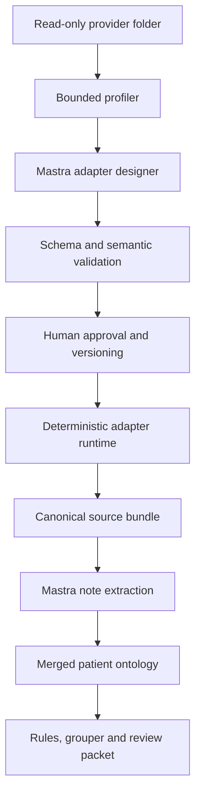

# Bulk adapter factory

## Purpose

Providers can deliver deidentified bulk exports without first implementing FHIR or a product-specific API. The adapter factory converts those exports into the same canonical source-bundle and patient-ontology contracts used by the rest of the system. Variability is isolated at the ingestion edge; ontology validation, Mastra extraction, rules, grouping and audit do not become clinic-specific.

The design separates two planes:

| Plane | Responsibility | Model access | Production authority |
|---|---|---:|---:|
| Control plane | Profile an export and propose a draft adapter | Yes, through Mastra | None |
| Data plane | Execute an approved adapter and validate its output | No | Transform only |

An agent never receives filesystem, shell, network or arbitrary-code tools. It receives a bounded JSON profile: artifact names, worksheet names, column profiles, small deidentified samples and schema/content fingerprints. It returns a schema-constrained adapter definition with `status: draft`.

## Flow



The same deterministic compiler/runtime is used for design-time validation and production execution. A bounded repair loop can return compile or dry-run failures to the designer agent for at most three attempts. Approval remains external to the model.

## Input and output contracts

### Profiler input

- one directory treated as read-only;
- CSV, JSON, JSONL and XLSX resources;
- no symbolic links or paths outside the root;
- explicit file, byte, profile-row, runtime-row and output-case budgets.

The reader registry is the extension point for Parquet, database extracts, FHIR NDJSON and other formats. A new reader changes neither the adapter DSL nor downstream ontology/rule code.

### Profile output

`schemas/bulk_profile.schema.json` contains:

- artifact path, format and worksheet;
- columns, observed primitive types, missing counts and bounded distinct counts;
- a limited set of sample rows with per-value, per-artifact and column-count caps;
- `schema_fingerprint`, which changes when the discovered structural contract changes;
- `input_manifest_digest`, which fingerprints the exact file bytes used for a run.

The schema fingerprint gates adapter compatibility. The content digest supports audit and replay. Row values are deliberately excluded from the schema fingerprint so a valid adapter can process new encounters without being reapproved.

### Adapter definition

`schemas/adapter_definition.schema.json` is a versioned declarative mapping. It supports:

- named resources and worksheet selection;
- bounded row filters;
- encounter, document, claim and collection bindings;
- composite identifiers through templates;
- explicit transformations: trim, case normalization, numeric/boolean/date parsing, splitting and finite value maps;
- structured evidence, entity, relation and assertion projections;
- an exact ontology ID, version and semantic digest binding.

It does not support source code, SQL, regular expressions, dynamic imports, network calls or filesystem operations. New DSL operations require a reviewed runtime implementation, schema change and positive/negative tests in both contract layers.

### Runtime output

Each encounter becomes a source bundle containing:

- immutable encounter and claim fields;
- normalized narrative documents for Mastra extraction;
- a deterministic structured extraction fragment;
- row-addressable evidence locators with adapter, resource, path, optional worksheet, row number, source record and contributing fields;
- adapter version, schema fingerprint, exact input manifest digest and transform time.

Structured rows and model-extracted narrative facts are merged only after ID collision checks, evidence lineage checks, ontology class/relation/value-set validation and resource-budget enforcement. Model evidence cannot claim a deterministic source locator.

## Failure behavior

The reference runtime fails closed when it encounters:

- an unapproved adapter;
- schema or ontology drift;
- a missing file, worksheet, field, join key or claim row;
- an unlinked child row;
- an unmapped finite value;
- duplicate or conflicting IDs;
- a naive or invalid timestamp;
- a type-losing conversion;
- an ontology domain/range, value-set, evidence or lineage violation;
- a configured resource-budget violation.

Failures do not partially submit or modify a claim. CLI writes use atomic replacement and create a manifest mapping opaque output filenames to encounter IDs.

## Extending the system

Use the narrowest extension point:

1. Add a reader when the physical format is new.
2. Add or revise a versioned adapter when the clinic schema or encoding is new.
3. Add a DSL operation only when many adapters require the same deterministic behavior.
4. Extend and version the ontology when a new clinical concept or relationship is required.
5. Add a rule package when a validated ontology fact should produce a review candidate.
6. Replace the in-memory reader/executor with a streaming or distributed implementation behind the same contracts for large production exports.

Do not add clinic-specific branches to the ontology validator, rule engine or grouper boundary.

## Reference commands

```bash
revenue-integrity-ingest profile examples/bulk/clinic_alpha \
  --output output/clinic-alpha.profile.json

revenue-integrity-ingest run \
  examples/bulk/clinic_alpha \
  examples/adapters/clinic_alpha_wound_care_v1.json \
  --output-directory output/source-bundles \
  --report output/clinic-alpha.run.json
```

The bundled adapter is synthetic and approved only for the demo. A production adapter requires representative validation data, source-owner sign-off, clinical/coding review for structured projections, deployment approval and ongoing drift monitoring.
